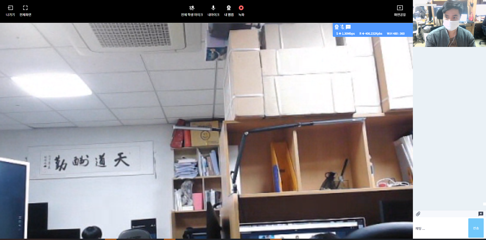
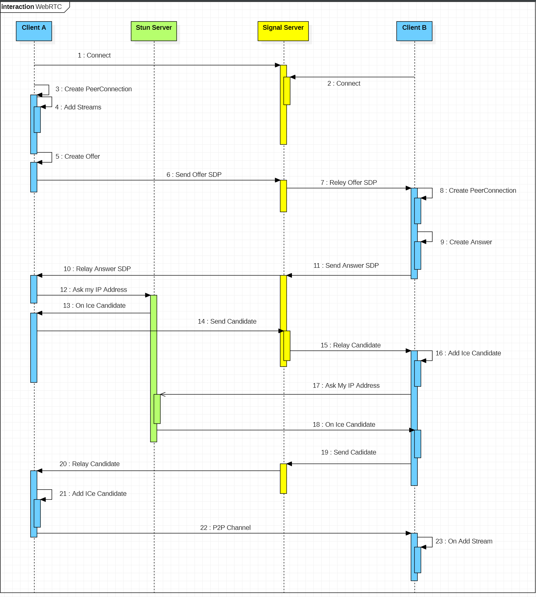
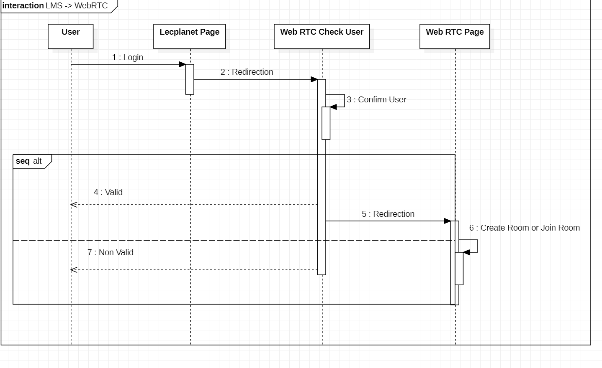
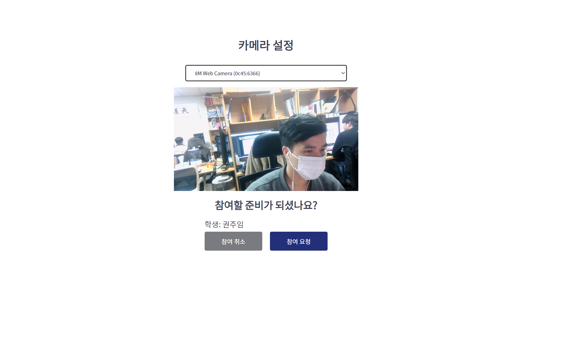
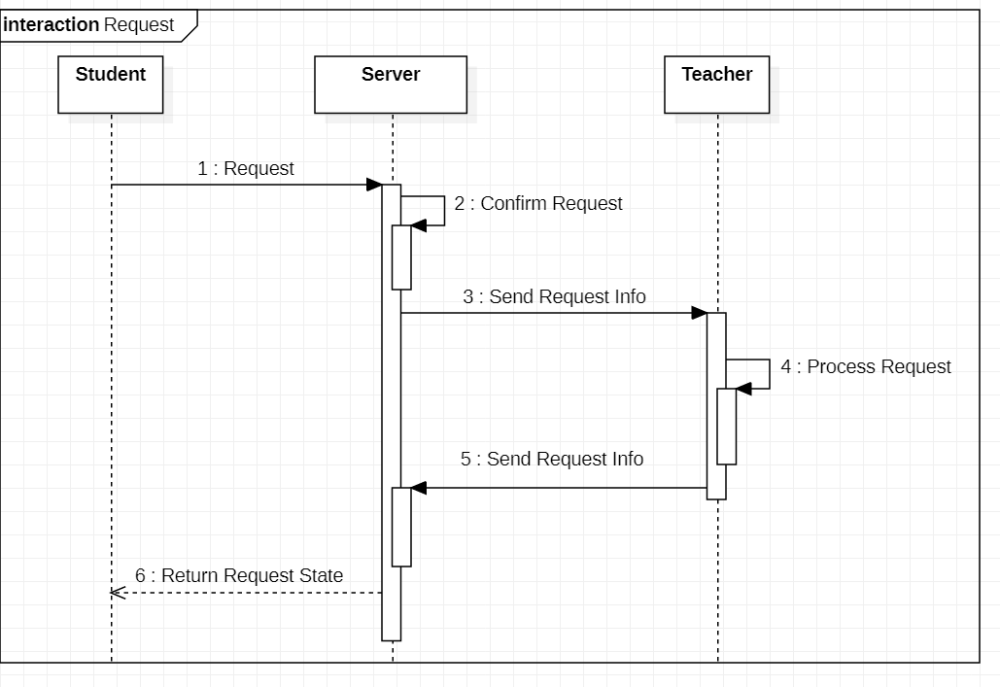
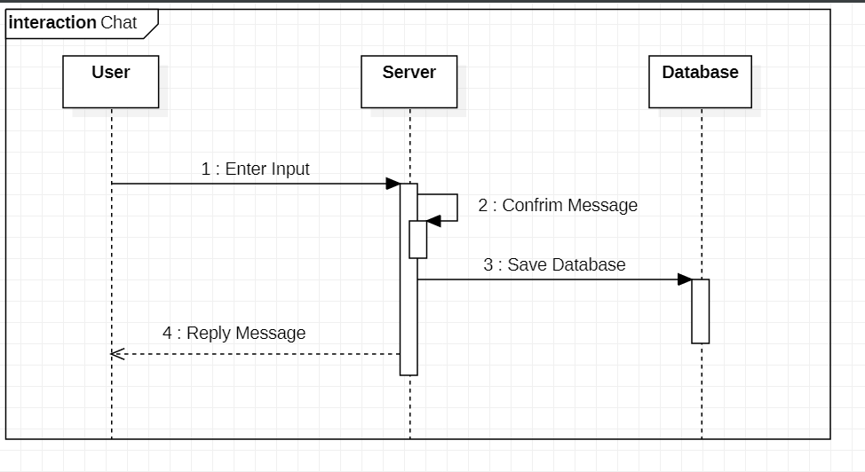
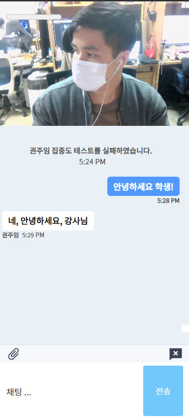

<h1 align="center" style="display: block; font-size: 2.5em; font-weight: bold; margin-block-start: 1em; margin-block-end: 1em;">
<a name="logo" href="#">
  </a>
  <br><br><strong>웹RTC 기반으로 1:N 화상 미팅</strong>
</h1>


---
## 소개[](#introduction)
**프로젝트 관리 페이이지 클라이언트**라는 프로젝트는 동국대학교 PLASS 연구실 연구원들이 개발하는 프로젝트입니다.

---

## 목차[](#table-of-contents)
1. [개발 환경](#개발-환경)
2. [실행 방법](#실행-방법)
3. [기능 명세서](#기능-명세서)
4. [개발 멤버](#개발-멤버)

---

## 개발 환경[](#dev-env)
- [Node.js](https://nodejs.org/)
- [React.js](https://reactjs.org/)

## 실행 방법[](#install)
```bash

# Clone this repository
git clone `` 

# Go into the repository
cd client-webrtc

# Install dependencies
npm start

# .env create env file
REACT_APP_SERVER_API=https://
REACT_APP_SERVER_SOCKET=https://

# Run the app
$ npm start
```
> 💡 정상적으로 올리는지 확인: `open https://localhost:3005` 명령어를 사용하여 웹브라우저로 접속함 <br>
> 💡 Docker 빌드: `docker build . -t project-client:1.1`

---

## 기능 명세서[](#feature)
#### 웹RTC 동작 방식 
</br>
<div align="center">
  
</div>
</br>

#### 입장 페이지
LMS부터 유저가 설정페이지를 먼저 접근하며 이 페이지에서 유저가 원하는 카메라를 설정할 수 있다. "참여 요청"이라는 버튼을 클릭 시 바로 입장한다.
</br>
<div align="center"  style="display: flex; justify-content: space-between;">
  
  
</div>
</br>

#### 프로젝트 목록
유저가 "프로젝트 생성"이라는 버튼을 클릭 시 프로젝트 생성 페이지를 노출되어서 유저가 프로젝트에 대한 기존 정보를 입력하게 된다. 프로젝트 정보를 입력한 다음에 프로젝트를 생성한다.

#### 호스트 출력 화면
호스트 화면에서 가가기, 전체화면 또는 전체 학생 마이크, 내마이크 설정, 화면공유 기능 제공한다.
</br>
<div align="center" style="display: flex; justify-content: space-between;">
  
  
</div>


#### 게스트 출력 화면
게스트 화면에서 가가기, 전체화면 또는 음성질문 요청, 자리비움 요청 기능 제공한다.
</br>
<div align="center">
  
</div>
</br>

#### 재팅 부분
모든 참여자들이 메시시 채팅 및 파일 업데이트 가능한다.
</br>
<div align="center" style="display: flex; justify-content: space-between;">
  
  
</div>
</br>

## 개발 멤버[](#member)
- 동국대학교 PLASS 연구실 연구원

<h1 align="center" style="display: block; font-size: 2.5em; font-weight: bold; margin-block-start: 1em; margin-block-end: 1em;">
END
</h1>